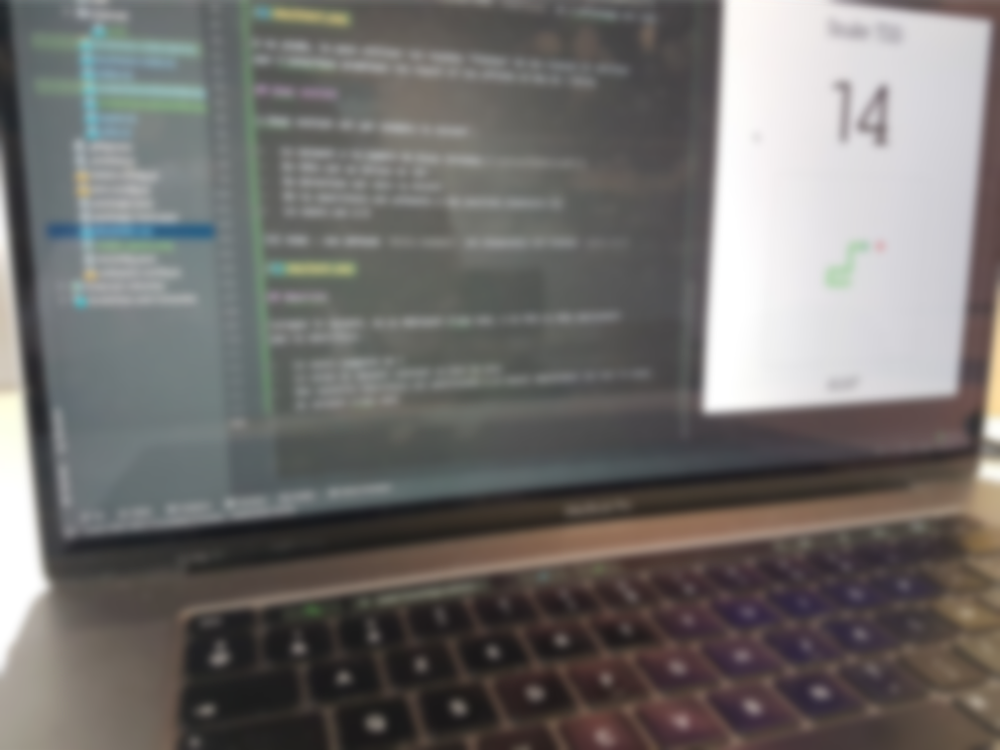

>Ce dépôt contient quelques sujets de Katas que j'aime bien utiliser dans mes démos de live coding, 
> notamment pour montrer le TDD en action, ou que j'aime bien proposer en coding-dojo. 
> Il y a également des katas en cours d'élaboration ou de test ou de simples idées... 😉

N'hésites pas :

- à suivre ("watch") ce dépôt pour suivre les évolutions
- à mettre une étoile ⭐️ si tu aimes bien
- à laisser des commentaires, remarques, suggestions, ...
- à faire des PR pour compléter, améliorer, corriger, ...

# Les sujets de Kata

| Sujet                                                 | Pourquoi je l'aime bien                                                |
|-------------------------------------------------------|------------------------------------------------------------------------|
| [Calcul de prix](./pricer.md)                         | Sujet basique pour expérimenter le TDD                                 |
| [Calcul de prix avec API fluent](./pricer_fluent.md)  | Mettre en place une API fluent                                         |
| [Statistiques de cinéma](./statistiques_de_cinéma.md) | Manipulation de données (filter/map/reduce)                            |
| [Le notificateur par mail](./notifier.md)             | Mocks                                                                  |
| [Le "TDD du serpent" ou "Snake TDD"](./snake.md)      | Du code qu'on peut tout de suite exécuter/utiliser/tester pour de vrai |

# Et des trucs à essayer 

- [Coding dojo muet](./coding-dojo-muet.md)
